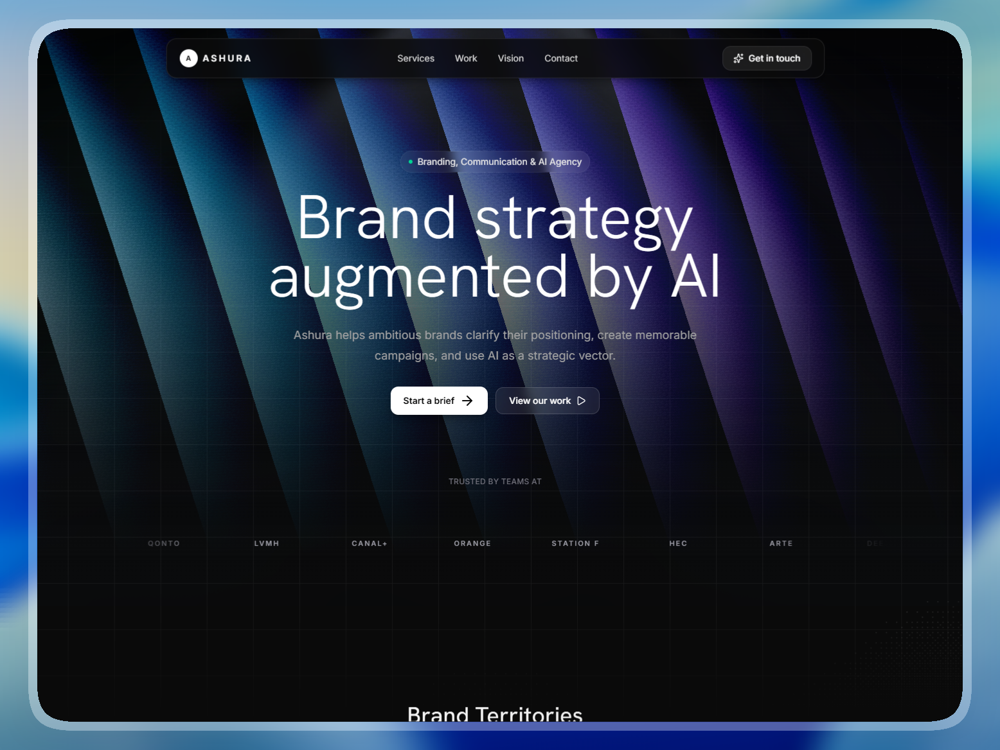

# 🐼 Shiro — Personal AI Assistant Landing Page

> **Day 14/30 of the "Building 1 AI-Generated Landing Page Every Day" Challenge**



## 🚀 About

Conceptual landing page for **Shiro**, a **premium Personal AI Assistant** that manages your daily schedule and eliminates procrastination. Developed with **Next.js 16**, **TypeScript**, and **Tailwind CSS 4**. This project is the fourteenth realization of an ambitious challenge: creating **1 complete and functional mockup per day using AI**.

Shiro is designed to turn scattered thoughts, notes, and tasks into a cohesive, actionable daily plan. The goal is to provide **mental clarity**, **seamless organization**, and **uninterrupted focus** through a high-end, bento-inspired digital experience.

Live URL: [https://shiro-landing.adrielzimbril.com](https://shiro-landing.adrielzimbril.com)

## 🎨 Design & Aesthetic Decisions

For this project, the theme focuses on **productivity, cognitive ease, and procrastination-free workflows**.

- **Modern Aesthetic:** A refined violet and slate palette with high-end glassmorphism, subtle gradients, and a "clean workbench" feel.
- **Performance First:** Leveraging Next.js 16's latest features for instant loading and smooth transitions.
- **Bento Grid Layout:** Organizing complex information into clear, distinct cards that simulate a productivity dashboard.
- **Purposeful Interactions:** Entrance reveals, floating UI elements, and interactive priority cards that make the experience feel alive yet calm.
- **Premium Typography:** Using **Inter** for clarity and **JetBrains Mono** for that precise, assistant-like data aesthetic.

## 🧩 Key Sections

- **🌟 Hero Section:** High-impact introduction with floating UI bubbles representing captured thoughts and drafted actions.
- **🧠 Problem Context:** A deep dive into the "scattered work" problem and how Shiro provides the solution.
- **⚡ Feature Bento:** A masonry-style grid showcasing core capabilities like Briefings, Focus Windows, and Smart Replies.
- **🔄 Workflow Sync:** Visualizing how Shiro integrates across devices to keep you organized everywhere.
- **🔒 Privacy First:** Highlighting the secure, private-by-design architecture of the assistant.
- **🌐 Modern Footer:** Comprehensive navigation and social links.

## 🛠️ Tech Stack

This mockup was built with cutting-edge technologies:

- **[Next.js 16](https://nextjs.org/)** with App Router and Turbopack
- **[React 19](https://react.dev/)**
- **TypeScript** for scalable component architecture.
- **[Tailwind CSS v4](https://tailwindcss.com/)** for modern design tokens and utilities.
- **[Motion/React](https://motion.dev/)** for sophisticated entrance and hover animations.
- **[Lenis](https://lenis.darkroom.engineering/)** for smooth scroll behavior.
- **[Lucide React](https://lucide.dev/)** for clean iconography.

## 🚀 Quick Start

```bash
# Install dependencies
pnpm install

# Run development server
pnpm dev
```

Open [http://localhost:3000](http://localhost:3000) in your browser to see the result.

## 🌌 Let's meet in space (or on Earth) 🚀

I'm always happy to discuss new projects, collaborations, or simply exchange creative ideas. Here's how to contact me:

- **📧 Email**: [hello@adrielzimbril.com](mailto:hello@adrielzimbril.com)
- **🌐 Website**: [https://www.adrielzimbril.com](https://www.adrielzimbril.com)
- **🐦 Twitter**: [https://twitter.com/adrielzimbril](https://twitter.com/adrielzimbril)
- **💼 LinkedIn**: [https://www.linkedin.com/in/adrielzimbrilcode](https://www.linkedin.com/in/adrielzimbrilcode)
- **🐼 GitHub**: [https://github.com/adrielzimbril](https://github.com/adrielzimbril)

### 🐼 Fun Facts

- 🚀 Passionate about space exploration and technology
- 🐼 Love pandas (and animals in general!)
- 🎨 Creative at heart, whether in design or code
- ☕ Addicted to coffee and complex technical challenges

## 🌟 Join the Adventure

If you like this project, feel free to:

- ⭐ Star the project
- 🐞 Report bugs
- ✨ Suggest improvements
- 🚀 Share with other enthusiasts

## 💖 Support the Project

If you find this project useful and would like to support its development, you can do so through these platforms:

[](https://go.adrielzimbril.com/gs)

## 🌐 Hosting

This project is 100% hosted on modern cloud infrastructure for maximum performance and reliability:

[](https://vercel.com)

## 📄 License

This project is under the MIT license. Feel free to use it as a base for your own portfolio or project.

---

**Developed with ❤️ by Adriel Zimbril**
_Product Designer & Fullstack Developer_
🚀 Digital Universe Explorer | 🐼 Panda Friend | 🎨 Passionate Creator
